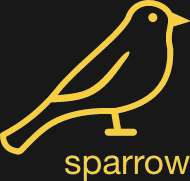

# Sparrow Chat



---

## What is Sparrow Chat app?

Sparrow Chat is born out of a group project at [Code the Dream](https://learn.codethedream.org/sparrow-react-practicum/ "Code the Dream") to gain experience working on a development team and on a real-world, deployable project.

Sparrow Chat is a responsive web chat app in React that uses [Firebase](https://firebase.google.com/ "Firebase") services such as Cloud Firestore database to store chatroom messages and Firebase Authentication to sign in using Google sign-in.

Users enter the landing page to sign in, then are routed to our chat room. Here, the main content window displays all messages. The left pane reveals all the users in the chat room and the bottom input field is where users can type and send messages. The navbar displays our Sparrow logo and the sign-out button.

Below is a look at our chat app built and deployed in a span of 8 weeks:

[screenshot/short video of app working]

## Getting Started

### How to access our deployed app:

```bash
git clone git@github.com:badgerbadgers/ctd-sparrow-chat-app.git

npm install

npm start
```

### How to run the app locally:

After running

```bash
npm start
```

on your terminal...

(Firebase info goes here)

## Thank you

We want to extend our thanks to Code the Dream for providing a space to collaborate and practice working on a development team.

React Mentors:

- Jared Siirila
- Elijah Bernstein-Cooper
- Karson Kalt
- Michael Howey
- Lin Clark

Practicum Mentors:

- Justin Kong
- Murial Anindo
